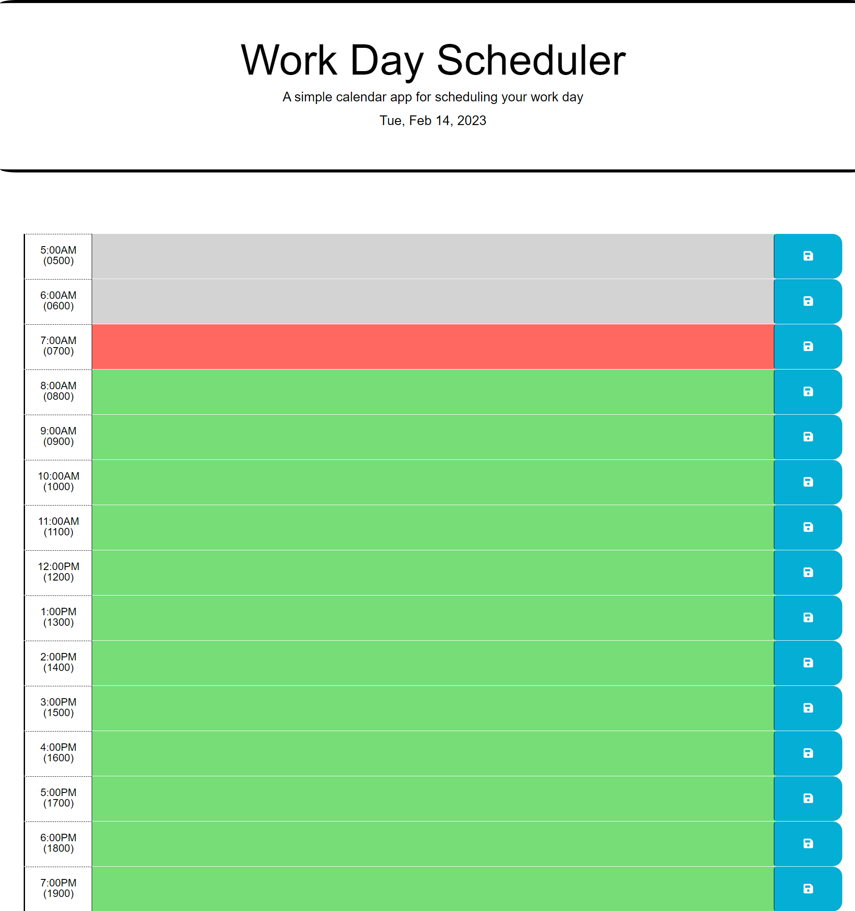

# The Neat Work Day Scheduler

## Description

The Neat Work Day Scheduler is a web based planner made for scheduling tasks each day. The planer will store your tasks until deleted and will adjust the time-blocks based on the time being in the past, present or future. 

It gives users color-coded past/present/future time blocks to help better visualize the upcoming tasks and those that have passed. 

I definitely learned a lot about jQuery and CSS frameworks throughout the development of this application. 

## Installation
N/A

## Usage
This scheduler is to be used by any individual looking for a way to schedule tasks, reminders, or any kind of to-do list throughout their day.
It can be used for work, at work, just for plain old organization, or anything you may need. 

A neat feature about this application is that it locally stores the data the user inputs until it's cleared out by the respective user.
If you open up the console, you can find the user input data in the local storage.  

## Deployed URL:
https://blairrrrwho.github.io/the-neat-work-day-scheduler/ 

## Credits

I'd like to thank all of my fellow classmates for their support and help throughout the development of this application. 
Just to list a few...

Christina Hall, BJ Thompson, Lacey Angarita, Terry Lequernaque, Cailen Hamm, Joshua Pierre, Vincent Teune, and Sandy Smith

## License
MIT License

Please refer to the LICENSE in the repo.